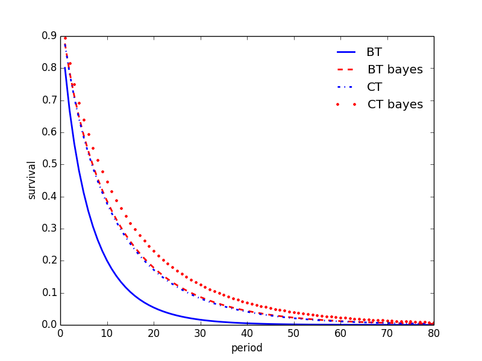

## Outline

- motivation

- research question

- design

- preliminary 

## different reasons why people do not hold stocks

- risk aversion

- loss aversion

- transactions costs, etc. 

## do these reasons apply to private equity? 

- different information structure

- returns **unobservable** when out

## design

- stock return at time $t$ is $x_t$

- $x$ follows autoregressive process

- bond yields a payout $c$ 

## design - public equity

<video id="sampleMovie1" src="inoutarea.mov" loop="true" autoplay="true" controls></video>

## design - private equity

- $x$ is still displayed when OUT

## predictions 

- subjects prefer to explore 

- better information leads to participation

## predictions

- forecasting rules of $x_{t+1} = \rho x_t + \epsilon_{t+1}$

- Landier, Ma and Thesmar wp, 2018
- *extrapolative expectations*
- *sticky expectations* 
$$
F_{t} x_{t+1} = (1-\lambda)\sum^2_{k=0}\lambda^k E_{t-k} x_{t+1}+\gamma \sum^2_{k=0}\lambda^k (x_{t-k}-E_{t-k-1}x_{t-k})
$$

## predictions (bayes)

- players observe $y=x+e$

- similar to Kalman Filter. 

## An example (bayes)

## results

## results 

## results 

## results 

## conclusion

- exploration effects overcome risk and loss aversion. 

- financing matters for people participation

## work in progress

- rely on forecasting rules

- swithcing in/out is a form of stop-loss orders. 

- this is proven to be suboptimal. 

- build porftfolios with mixed shares. 

